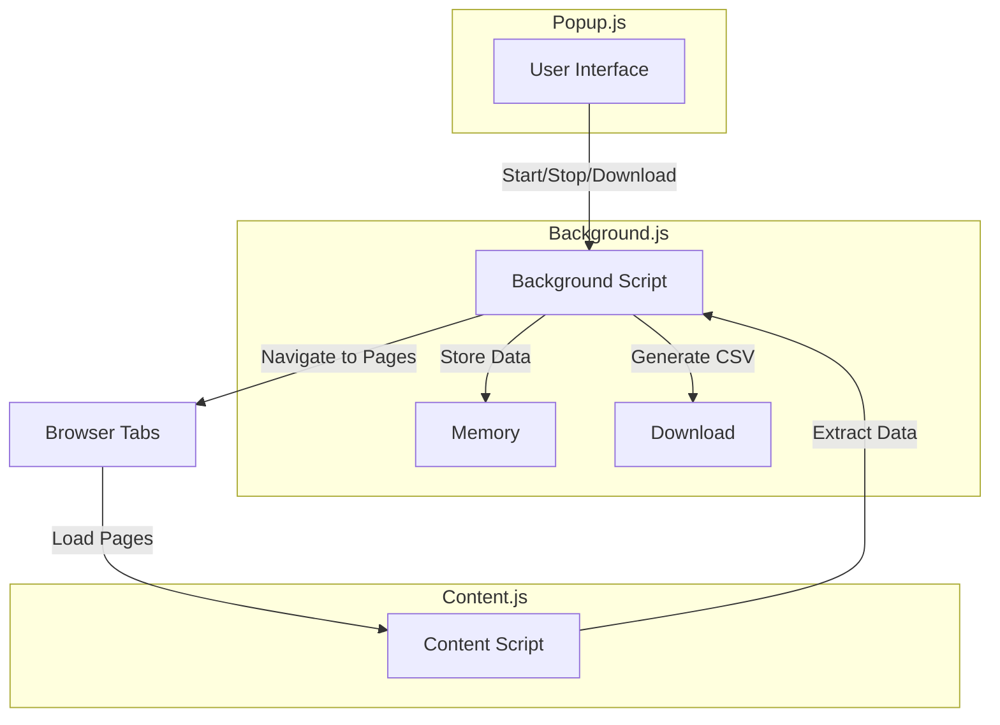

# Ghost Web Scraper Chrome Extension

The **Ghost Web Scraper** Chrome extension allows you to scrape property listings from a popular online platform. It can navigate through multiple pages of listings, extract property details from both listing and detail pages, and export the data to CSV format.

## Features

- Scrapes property listings from an online platform
- Handles URLs with query parameters and multiple locations
- Navigates through paginated results
- Visits individual property detail pages to extract more information
- Exports collected data to CSV format
- Preserves search filters while navigating between pages

## Installation

1. Clone or download this repository
2. Open Chrome and navigate to `chrome://extensions/`
3. Enable "Developer mode" by toggling the switch in the top right corner
4. Click "Load unpacked" and select the directory containing the extension
5. The extension should now appear in your Chrome toolbar

## How to Use

1. Navigate to the property website and search for properties
2. Apply any filters you need (price range, property features, etc.)
3. Click on the extension icon to open the popup
4. Set the start and end page numbers for scraping
5. Set the delay between page requests (minimum 1500ms recommended to avoid rate limiting)
6. Click "Start" to begin scraping
7. Once scraping is complete, click "Download CSV" to export the collected data

## Architecture

The extension consists of three main JavaScript files:
- **popup.js**: Handles the user interface and sends commands to the background script
- **background.js**: Manages the scraping process, navigation, and data collection
- **content.js**: Extracts data from web pages and sends it to the background script

## Flow Diagram

## Detailed Process Flow

1. **User starts scraping process:**
   * User inputs parameters in popup
   * Popup sends "startScraping" message to background script

2. **Background script initializes scraping:**
   * Sets up scraping parameters
   * Extracts base URL components while preserving query parameters
   * Navigates to first page

3. **Content script extracts listing data:**
   * Detects property cards on page
   * Extracts basic property information (address, price, beds, baths, etc.)
   * Sends data to background script

4. **Background script processes listing results:**
   * Stores listing data
   * Sends progress update to popup
   * Begins visiting detail pages if enabled

5. **Content script extracts detail page data:**
   * Extracts detailed property information (description, features)
   * Sends data to background script

6. **Background script processes detail results:**
   * Updates property data with details
   * Continues to next detail page or back to listing
   * Navigates to next page when a batch is complete

7. **Background script completes scraping:**
   * Sends completion message to popup
   * Enables CSV download

8. **User exports data:**
   * Clicks "Download CSV" button
   * Background script generates and downloads CSV file

## Key Functions

### background.js
| **Function** | **Description** |
|--------------|-----------------|
| startScrapingProcess | Initializes the scraping process and extracts base URL |
| extractBaseUrl | Parses the URL and extracts base components while preserving query parameters |
| constructPageUrl | Builds the URL for a specific page number while preserving query parameters |
| loadPageAndScrape | Navigates to a specific page and triggers content script |
| visitNextPropertyDetailPage | Navigates to a property detail page |
| returnToListingPage | Returns to the listing page after visiting detail pages |
| continueToNextPageOrFinish | Proceeds to next page or completes the scraping process |
| generateCSV | Creates and downloads a CSV file with collected data |

## Data Structure

The extension collects the following data for each property:

* Basic property information (from listing page):
   * Address
   * Price (with special handling for "Indicative Price" and unlisted prices)
   * Number of bedrooms, bathrooms, parking spaces
   * Land size
   * Property type
   * Agent
   * URL
   * Image URL

* Detailed property information (from detail page):
   * Description
   * Features (categorized by room/area)

## URL Handling

The extension properly handles various URL patterns, including:

* URLs with query parameters:
   * https://www.example.com/buy/property-house-in-vermont,+vic+3133/list-1?misc=ex-under-contract&source=refinement

* URLs with multiple locations:
   * https://www.example.com/buy/property-house-in-vermont,+vic+3133%3b+invermay,+tas+7248%3b+tasmania/list-1?misc=ex-under-contract&source=refinement

The extension preserves all search parameters when navigating between pages, ensuring that your filters remain active throughout the scraping process.

## Price Handling

The extension handles different price scenarios:
* Regular listed prices
* Indicative prices (labeled as "Indicative Price: [range]")
* Properties with no price listed (labeled as "Price Not Mentioned!")

## Troubleshooting

* **No properties found**: Verify that you're on a valid property listing page with property cards visible.
* **Slow performance**: Try increasing the delay between requests to avoid rate limiting.
* **Properties missing details**: Some properties may not have all details available on their listing.
* **Extension not working after website update**: The website structure may have changed. Check for extension updates.

## Best Practices

* Use a reasonable delay between page requests (1500-3000ms) to avoid being rate-limited
* Limit the number of pages you scrape in a single session (5-10 pages at a time)
* Be respectful of the website's resources and avoid excessive scraping

## License

* Mayank Yadav